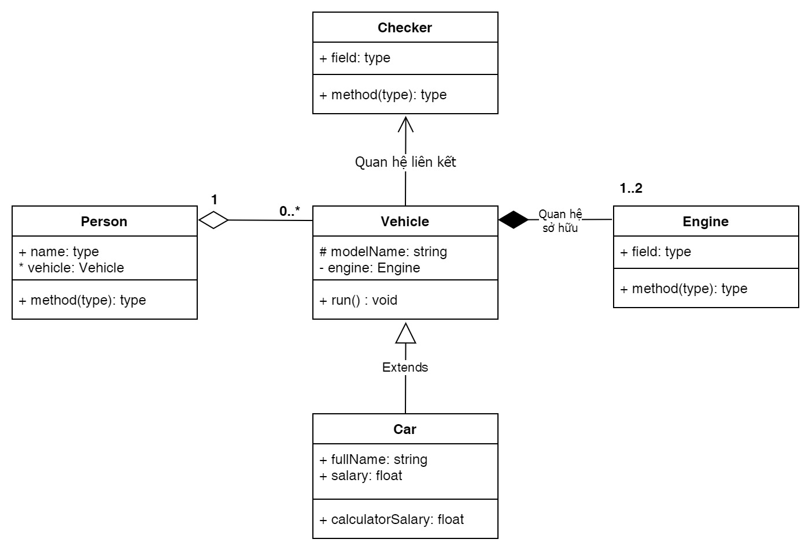

0..\*: Có thể có nhiều hơn 0 hoặc không có
1..2: Có thể có từ 1 đến 2

# Class Diagram

# Relationships

- [ ] Aggregation: Mối quan hệ giữa các lớp, một lớp chứa các lớp khác
- [ ] Composition: Mối quan hệ giữa các lớp, một lớp chứa các lớp khác và không thể tồn tại nếu lớp chứa bị hủy

# Thủ thuật Forward-declaration

- Liệt kê tất cả các class ra trước
  - class Checker();
  - class Vehicle();
  - class Car();
  - class Engine();

# Thêm ảnh vào đây

// https:// drive.google.com/file/d/1hUy8Zvo1sDIvKeTfhTFGQuzpkJgHb7ZH/view?usp=sharing

/*
    Mối quan hệ bao hàm ( A has a B)
    - Mối quan hệ bao hàm là mối quan hệ giữa các lớp, trong đó một lớp chứa một đối tượng của lớp khác.
*/
/*
    Quan hệ sử hữu ( Agrigation)
    - Quan hệ sở hữu là một dạng quan hệ giữa các lớp, trong đó một lớp chứa một hoặc nhiều đối tượng của lớp khác.
*/